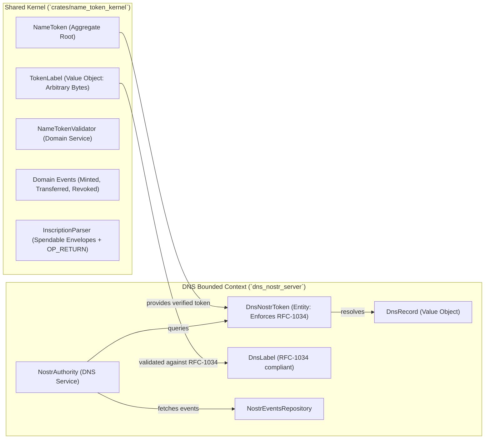

# Data Model & Domain Architecture: ddd-artifacts

**Feature**: [001-refactor-ddd]
**Spec**: [spec.md](spec.md)

## Context Map



---

## 1. Shared Kernel (`crates/name_token_kernel`)

### 1.1 `TokenLabel` (Value Object)
Represents a generic, byte-based Name-Token identifier on the Bitcoin blockchain.

- **Attributes**:
  - `bytes: Vec<u8>`
- **Invariants & Validation (FR-008)**:
  - Must not be empty.
  - Length must not exceed protocol maximum (e.g., 255 bytes).
  - Does **not** enforce RFC-1034 rules (arbitrary byte sequences, UTF-8 strings, mixed case, or symbols are permitted at the protocol layer).
- **Methods**:
  - `TokenLabel::new(bytes: impl Into<Vec<u8>>) -> Result<TokenLabel, TokenLabelValidationError>`
  - `as_bytes(&self) -> &[u8]`
  - `as_utf8(&self) -> Result<&str, Utf8Error>`
- **Traits**:
  - `Eq, PartialEq, Ord, PartialOrd, Hash, Clone, Debug`

---

### 1.2 `InscriptionSection` & `Inscription` (Value Objects)
Parsed protocol payload from blockchain script.

- **`InscriptionSection`**:
  - `protocol: Vec<u8>` (e.g., `b"dns-nostr"`)
  - `arguments: Vec<Vec<u8>>`
- **`Inscription`**:
  - `label: TokenLabel`
  - `sections: Vec<InscriptionSection>`

---

### 1.3 `BlockchainPosition` (Value Object)
Represents a deterministic position on the Bitcoin ledger for First-is-Root ordering.

- **Attributes**:
  - `block_height: u64`
  - `block_index: usize` (transaction index in block)
  - `vout: u32` (output index in transaction)
  - `txid: bitcoin::Txid`
- **Ordering**:
  - Implements `Ord`, `PartialOrd`, `Eq`, `PartialEq`.
  - Ordered by `(block_height, block_index, vout)`.

---

### 1.4 Domain Events (Event Sourcing)
Past-tense events representing immutable facts that occurred on the blockchain.

#### `NameTokenMinted`
- `label: TokenLabel`
- `mint_position: BlockchainPosition`
- `outpoint: bitcoin::OutPoint`
- `inscription: Inscription`
- `locking_script: bitcoin::ScriptBuf`

#### `NameTokenTransferred`
- `label: TokenLabel`
- `transfer_position: BlockchainPosition`
- `previous_outpoint: bitcoin::OutPoint`
- `new_outpoint: bitcoin::OutPoint`
- `new_locking_script: bitcoin::ScriptBuf`

#### `NameTokenRevoked`
- `label: TokenLabel`
- `revocation_position: BlockchainPosition`
- `spent_outpoint: bitcoin::OutPoint`
- `spending_txid: bitcoin::Txid`

#### `NameTokenDomainEvent` (Enum)
```rust
pub enum NameTokenDomainEvent {
    Minted(NameTokenMinted),
    Transferred(NameTokenTransferred),
    Revoked(NameTokenRevoked),
}
```

---

### 1.5 `NameToken` (Aggregate Root)
An event-sourced aggregate representing the lifecycle and ownership state of a registered Name-Token.

- **Identity**:
  - `label: TokenLabel` (domain identifier globally governed by First-is-Root)
  - `mint_position: BlockchainPosition` (genesis point of registration)
- **State**:
  - `status: TokenStatus`:
    - `Active { current_outpoint: bitcoin::OutPoint, current_script: bitcoin::ScriptBuf }`
    - `Revoked { burned_by_position: BlockchainPosition, spending_txid: bitcoin::Txid }`
  - `inscription: Inscription`
- **Lifecycle & Invariants**:
  - Created by applying `NameTokenMinted`.
  - Can transition from `Active` to `Active` via `NameTokenTransferred`.
  - Can transition from `Active` to `Revoked` via `NameTokenRevoked`.
  - Cannot be transferred or modified once in `Revoked` state (attempting to apply an event to a revoked token returns `DomainError::TokenAlreadyRevoked`).
  - Sequence positions must be strictly monotonically increasing.
- **Methods**:
  - `NameToken::from_events(events: impl IntoIterator<Item = NameTokenDomainEvent>) -> Result<NameToken, DomainError>`
  - `NameToken::mint(event: NameTokenMinted) -> Result<NameToken, DomainError>`
  - `apply(&mut self, event: NameTokenDomainEvent) -> Result<(), DomainError>`
  - `is_active(&self) -> bool`
  - `current_outpoint(&self) -> Option<&bitcoin::OutPoint>`
  - `label(&self) -> &TokenLabel`
  - `inscription(&self) -> &Inscription`

---

### 1.6 `NameTokenValidator` (Domain Service)
Enforces the "First-is-Root" validation rule.

- **Inputs**: Multiple candidate `NameToken` aggregate roots claiming the same `TokenLabel`.
- **Validation Logic**:
  1. Filters for tokens matching the requested `TokenLabel`.
  2. Compares their `mint_position` using the full tuple `(block_height, block_index, vout)`.
  3. Returns the candidate with the earliest tuple as the canonical valid token.
- **Methods**:
  - `NameTokenValidator::select_first_confirmed<'a>(&self, candidates: &'a [NameToken]) -> Option<&'a NameToken>`
  - `NameTokenValidator::is_first_confirmed(&self, candidate: &NameToken, competing: &[NameToken]) -> bool`

---

## 2. DNS Bounded Context (`dns_nostr_server`)

### 2.1 `DnsNostrToken` (Entity in DNS Context)
Bridges a verified `NameToken` to Nostr resolution capabilities while strictly enforcing RFC-1034 DNS label rules.

- **Attributes**:
  - `label: hickory_server::proto::rr::domain::Label` (RFC-1034 compliant)
  - `nostr_pubkey: nostr::PublicKey`
- **Construction & Invariants (FR-008 & Constitution Principle IV)**:
  - `TryFrom<&NameToken>`:
    1. Validates that the token's `TokenLabel` is RFC-1034 compliant:
       - Lowercase ASCII letters (`a-z`), digits (`0-9`), and hyphens only.
       - Starts with a letter (`a-z`).
       - Does not end with a hyphen.
       - Length between 1 and 63 characters.
    2. Validates that the token has an active `dns-nostr` inscription section containing a valid 32-byte Nostr public key.
    3. Rejects revoked tokens.

---

### 2.2 `DnsRecord` (Value Object)
Represents a parsed DNS record retrieved from Nostr zone files.

- **Attributes**:
  - `name: String`
  - `record_type: RecordType` (A, AAAA, CNAME, NS, MX, TXT)
  - `ttl: u32`
  - `rdata: String`

---

### 2.3 `NostrConflictResolver` (Domain Service in DNS Context)
Deterministically resolves conflicting Nostr events fetched from relays for a given public key.

- **Rule (FR-006)**:
  - Highest `created_at` timestamp wins.
  - If `created_at` is identical, lowest `event.id` (hex/bytes) wins.
